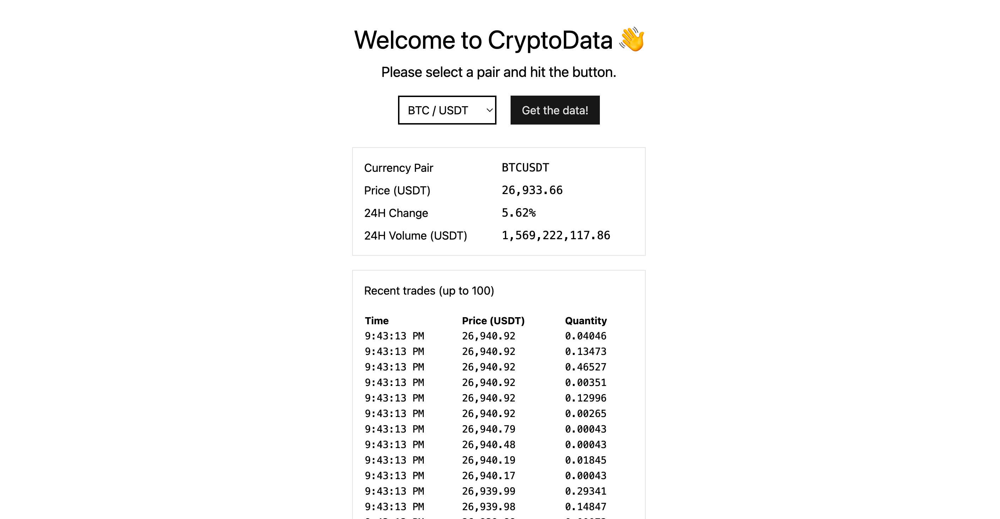

<h1 align="center">
  CryptoData
  <br>
</h1>

<h4 align="center">A simple app that fetches data from Binance on pairs of cryptocurrencies</h4>

<p align="center">
  <a href="https://crypto-data-eta.vercel.app/">Demo</a> •
  <a href="#key-features">Key Features</a> •
  <a href="#how-to-use">How To Use</a> •
  <a href="#tech-stack">Tech Stack</a> •
  <a href="#what-i-would-improve">What I would improve</a> •
  <a href="#license">License</a>
</p>



## Demo

Check out the demo [here](https://crypto-data-eta.vercel.app/).

## Key Features

* Select a pair of currencies between BTC, ETH and DOGE
* Click the button and get updated info about price, 24 change and 24 volume.
* Check a list of the 100 most recent trades as well
* Sort the table by clicking on the headers of the table
* Fully responsive
* Renders whether there's an error from the APIs

## How To Use

To clone and run this application, you'll need [Git](https://git-scm.com) and [Node.js](https://nodejs.org/en/download/) (which comes with [npm](http://npmjs.com)) installed on your computer. From your command line:

```bash
# Clone this repository
$ git clone https://github.com/oxcened/crypto-data

# Go into the repository
$ cd crypto-data

# Install dependencies
$ npm install

# Run the app
$ npm run dev
```

> **Note**
> If you're using Linux Bash for Windows, [see this guide](https://www.howtogeek.com/261575/how-to-run-graphical-linux-desktop-applications-from-windows-10s-bash-shell/) or use `node` from the command prompt.

## Tech Stack

* TypeScript v5
* React v18
* Vite.js v4

## What I would improve

Because I had limited time to do this there are certain things that I would have liked to do better:

* Splitting the APIs fetches so that in case one of the two errors, the other is independent
* Rendering the error returned from the API instead of a generic error
* Typing the response of the APIs so that mapping is done a bit more safely (Client and Server types)
* Localize strings in a json instead of hard coding them
* In a real life project I would opt for a more robust solution to fetch on the client like React Query
* A spinner icon when fetch is in progress instead of a "Loading" string
* Probably something else

## License

This project is [MIT licensed](./LICENSE).

---

> [alenajam.dev](https://alenajam.dev) &nbsp;&middot;&nbsp;
> GitHub [@oxcened](https://github.com/oxcened) &nbsp;&middot;&nbsp;
> Twitter [@oxcened](https://twitter.com/oxcened)

